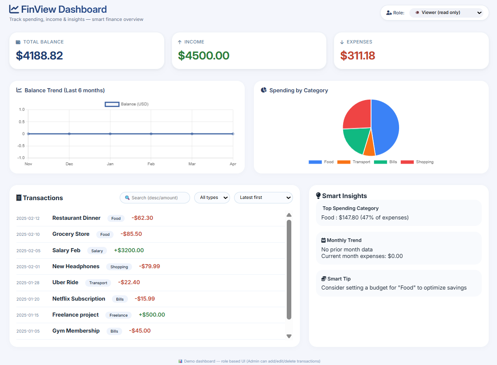
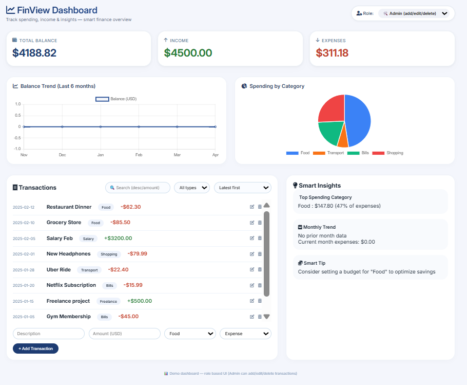

# FinView Dashboard - Personal Finance Tracker

A clean, interactive finance dashboard that helps users track income, expenses, and spending patterns with role-based access control.

## Problem Statement
Managing personal finances is difficult due to lack of clear insights into spending patterns. This dashboard helps users track income, expenses, and identify trends visually.

## Features

- **Summary Cards** - Total Balance, Income, Expenses
- **Time-based Chart** - 6-month balance trend line chart
- **Category Chart** - Spending breakdown pie chart
- **Transaction Management** - List with search, filter, and sort
- **Role-Based UI** - Viewer (read-only) / Admin (add/edit/delete)
- **Smart Insights** - Top spending category, monthly comparison, tips
- **Fully Responsive** - Works on desktop, tablet, and mobile

## Setup Instructions

1. Save all three files (`index.html`, `styles.css`, `script.js`) in the same folder
2. Open `index.html` in any modern web browser
3. No build steps or dependencies required!

## How to Use

1. **View Mode** - Browse transactions and insights
2. **Switch to Admin** - Use the role dropdown in header
3. **Add Transaction** - Fill form and click "Add Transaction"
4. **Edit/Delete** - Click pencil or trash icons (Admin only)
5. **Filter/Search** - Use the controls above the transaction list

## Technologies

- HTML5, CSS3, Vanilla JavaScript
- Chart.js for visualizations
- Font Awesome for icons
- Google Fonts (Inter)

## Reference Dashboard Images
## Viewer View

## Admin View

## Live Demo
👉 https://SunilKorapana.github.io/zorvyn_finance_dashboard